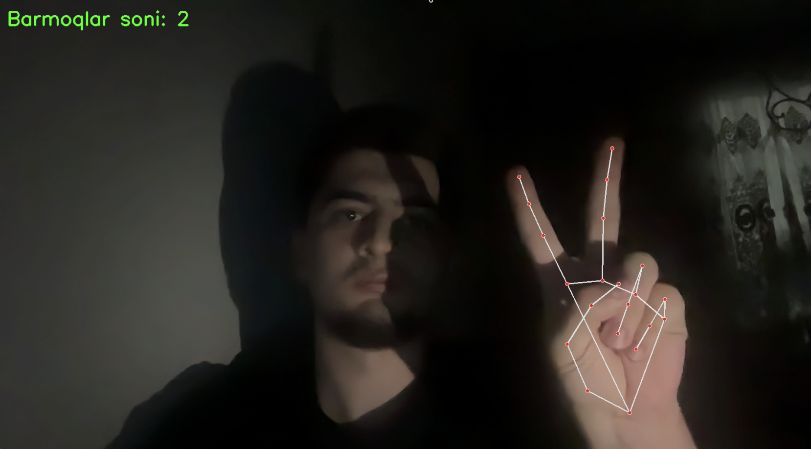

# ✋ Hand Finger Counter AI (Python)

Bu loyiha **Python + MediaPipe + OpenCV** yordamida yasalgan, oddiy va samarali **Test AI** bo‘lib, kamera orqali **qo‘ldagi barmoqlar sonini real vaqtda aniqlaydi**.

## 📸 Preview (Screenshot)

> Quyida loyiha ish jarayonidan olingan rasm




Loyiha asosan:
- Test uchun AI
- AI ga endi kirayotganlar uchun mustaqil qilinsa, 
ancha yordam beradi

---

## 🎯 Funksiyalar

- 📷 Kamera orqali qo‘lni aniqlash
- ✋ Qo‘ldagi 5 ta barmoqni kuzatish
- 🔢 Ochiq barmoqlar sonini hisoblash
- ⚡ Real vaqtda ishlash
- 🧠 Hech qanday model o‘qitishsiz (MediaPipe va Python kutubhonalari)

---

## 🧰 Texnologiyalar

- **Python 3.10** 
- **MediaPipe** — qo‘lni aniqlash (Hand Landmarks)
- **OpenCV** — kamera va tasvir bilan ishlash

---

## 📦 Talablar (Requirements)

> ❗ MediaPipe Python 3.10 bilan ishlaydi shu sababli, python versiyasiga etiborli bo'ling!
> Tavsiya etilgan versiya: **Python 3.10.x**

### Kerakli kutubxonalar
Quyidagi blokni **copy** qilib ishlatishingiz mumkin 👇

```txt
mediapipe==0.10.9
```
```txt
opencv-python
```
